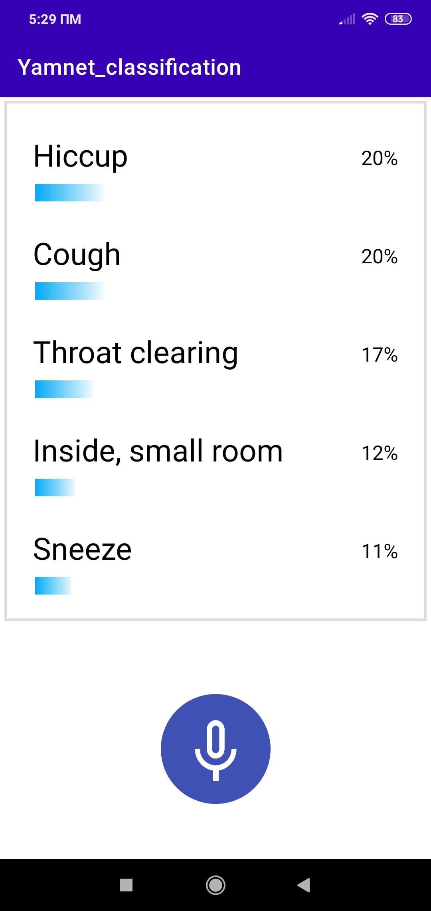

# Yamnet_classification_project

YAMNet is a pretrained deep net that predicts 521 audio event classes based on
the [AudioSet-YouTube corpus](http://g.co/audioset), and employing the
[Mobilenet_v1](https://arxiv.org/pdf/1704.04861.pdf) depthwise-separable
convolution architecture. You can find a great example with illustrations of this architecture [here](https://medium.com/@zurister/depth-wise-convolution-and-depth-wise-separable-convolution-37346565d4ec).

### Input: Audio Features

YAMNet was trained with audio features computed as follows:

* All audio is resampled to 16 kHz mono.
* A spectrogram is computed using magnitudes of the Short-Time Fourier Transform
  with a window size of 25 ms, a window hop of 10 ms, and a periodic Hann
  window.
* A mel spectrogram is computed by mapping the spectrogram to 64 mel bins
  covering the range 125-7500 Hz.
* A stabilized log mel spectrogram is computed by applying
  log(mel-spectrum + 0.001) where the offset is used to avoid taking a logarithm
  of zero.
* These features are then framed into 50%-overlapping examples of 0.96 seconds,
  where each example covers 64 mel bands and 96 frames of 10 ms each.

These 96x64 patches are then fed into the Mobilenet_v1 model to yield a 3x2
array of activations for 1024 kernels at the top of the convolution.  These are
averaged to give a 1024-dimension embedding, then put through a single logistic
layer to get the 521 per-class output scores corresponding to the 960 ms input
waveform segment.  (Because of the window framing, you need at least 975 ms of
input waveform to get the first frame of output scores.)

You can use the [yamnet tflite model](https://tfhub.dev/google/lite-model/yamnet/tflite/1) and insert it inside [netron app](https://netron.app/) to view the whole architecture and especially the first part where all transformations of audio input take place.

