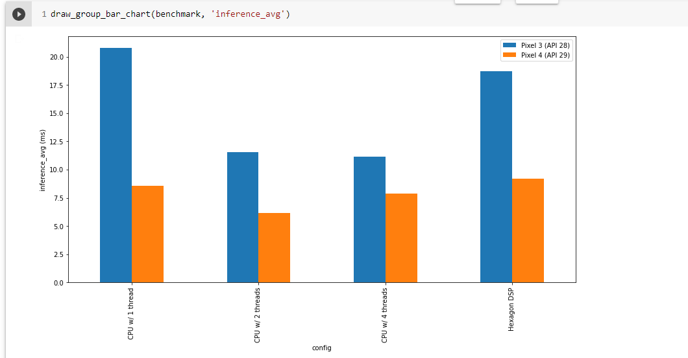

# Yamnet classification android application

This application uses phone's microphone to collect sound and feed it to the Yamnet model. The output is 5 top classes of sound of model's inference.

[YAMNet](https://github.com/tensorflow/models/tree/d9541052aaf6fdc015c8150cf6576a2da68771f7/research/audioset/yamnet) is a pretrained deep net that predicts 521 audio event classes based on
the [AudioSet-YouTube corpus](http://g.co/audioset), and employing the
[Mobilenet_v1](https://arxiv.org/pdf/1704.04861.pdf) depthwise-separable
convolution architecture. You can find a great example with illustrations of this architecture [here](https://medium.com/@zurister/depth-wise-convolution-and-depth-wise-separable-convolution-37346565d4ec).

## Input: Audio Features

YAMNet was trained with audio features computed as follows:

* All audio is resampled to 16 kHz mono.
* A spectrogram is computed using magnitudes of the Short-Time Fourier Transform
  with a window size of 25 ms, a window hop of 10 ms, and a periodic Hann
  window.
* A mel spectrogram is computed by mapping the spectrogram to 64 mel bins
  covering the range 125-7500 Hz.
* A stabilized log mel spectrogram is computed by applying
  log(mel-spectrum + 0.001) where the offset is used to avoid taking a logarithm
  of zero.
* These features are then framed into 50%-overlapping examples of 0.96 seconds,
  where each example covers 64 mel bands and 96 frames of 10 ms each.

These 96x64 patches are then fed into the Mobilenet_v1 model to yield a 3x2
array of activations for 1024 kernels at the top of the convolution.  These are
averaged to give a 1024-dimension embedding, then put through a single logistic
layer to get the 521 per-class output scores corresponding to the 960 ms input
waveform segment.  (Because of the window framing, you need at least 975 ms of
input waveform to get the first frame of output scores.)

You can download the [yamnet tflite model](https://tfhub.dev/google/lite-model/yamnet/tflite/1) and insert it inside [netron app](https://netron.app/) to view the whole architecture and especially the first part where all transformations of audio input take place.

## Output: Class scores

The model gives 3 outputs. Scores, emmbedings and spectograms. In this android application we focus on scores. App is tuned to collect  repeatedly 2 seconds of sound. After collection, sound is transformed to floats and is fed to the model. For this particular example we went with the interpreter implementation with CPU delegeate (2 threads) after benchmarking the model with the [TensorFlow benchmark tool](https://www.tensorflow.org/lite/performance/measurement). We did not use GPU as this delegate is not supporting some operators that model has and because inference with CPU was really fast. For 2 seconds of sound processing time is about 100ms! You can see one of the results of the tool below



As input features are framed into 50%-overlapping examples of 0.96 seconds for 2 seconds of sound we get 4 arrays of 521 values each. Then we get the average of these arrays on 0 axis (average of all the arrays' values on position eg 0,1,2...521) and we have a single array of 521 values that correspond to the probabilities of the 521 classes. Taking the top 5 classes we get on screen classes and scores with order from high to low.

## Explore the code

We're now going to walk through the most important parts of the sample code.

### Collect sound

You can find all the implementation of sound collection at [`ListeningRecorder`](https://github.com/farmaker47/Yamnet_classification_project/blob/master/app/src/main/java/com/soloupis/yamnet_classification_project/recorder/ListeningRecorder.kt) class. 

There you can find usefull functions on how to start recording process and write sound to `ByteArrayOutPutStream`

```
fun startRecording() {
        mRecorder = AudioRecord.Builder().setAudioSource(AUDIO_SOURCE)
            .setAudioFormat(AUDIO_FORMAT)
            .setBufferSizeInBytes(BUFFER_SIZE)
            .build()

        done = false
        mRecording = true
        mRecorder?.startRecording()
        mThread = Thread(readAudio)
        mThread!!.start()
    }
```

Pay attention to how we increase microphone gain

```
private val readAudio = Runnable {
        var readBytes: Int
        buffer = ShortArray(BUFFER_SIZE)
        while (mRecording) {
            readBytes = mRecorder!!.read(buffer, 0, BUFFER_SIZE)

            //Higher volume of microphone
            //https://stackoverflow.com/questions/25441166/how-to-adjust-microphone-sensitivity-while-recording-audio-in-android
            if (readBytes > 0) {
                for (i in 0 until readBytes) {
                    buffer[i] = Math.min(
                        (buffer[i] * 6.7).toInt(),
                        Short.MAX_VALUE.toInt()
                    ).toShort()
                }
            }
            if (readBytes != AudioRecord.ERROR_INVALID_OPERATION) {
                for (s in buffer) {

                    // Add all values to arraylist
                    bufferForInference.add(s)

                    writeShort(mPcmStream, s)
                }
            }
        }
    }
```
### Model's inference
You can find all the inference implementation at [`YamnetModelExecutor`](https://github.com/farmaker47/Yamnet_classification_project/blob/master/app/src/main/java/com/soloupis/yamnet_classification_project/ml_executor/YamnetModelExecutor.kt)

Inference is done inside `execute` function

```
fun execute(floatsInput: FloatArray): Pair<ArrayList<String>, ArrayList<Float>> {

        predictTime = System.currentTimeMillis()
        val inputSize = floatsInput.size // ~2 seconds of sound
        //Log.i("YAMNET_INPUT_SIZE", inputSize.toString())

        val inputValues = floatsInput//FloatArray(inputSize)

        val inputs = arrayOf<Any>(inputValues)
        val outputs = HashMap<Int, Any>()

        // Outputs of yamnet model with tflite and for 2 seconds .wav file
        // scores(4, 521) emmbedings(4, 1024) spectogram(240, 64)
        val arrayScores = Array(4) { FloatArray(521) { 0f } }
        val arrayEmbeddings = Array(4) { FloatArray(1024) { 0f } }
        val arraySpectograms = Array(240) { FloatArray(64) { 0f } }

        outputs[0] = arrayScores
        outputs[1] = arrayEmbeddings
        outputs[2] = arraySpectograms

        try {
            interpreter.runForMultipleInputsOutputs(inputs, outputs)
        } catch (e: Exception) {
            Log.e("EXCEPTION", e.toString())
        }

        val arrayMeanScores = FloatArray(521) { 0f }
        for (i in 0 until 521) {
            // Find the average of the 4 arrays at axis = 0
            arrayMeanScores[i] = arrayListOf(
                arrayScores[0][i],
                arrayScores[1][i],
                arrayScores[2][i],
                arrayScores[3][i]
            ).average().toFloat()
        }

        val listOfArrayMeanScores = arrayMeanScores.toCollection(ArrayList())

        val listOfMaximumValues = arrayListOf<Float>()
        for (i in 0 until 10) {
            val number = listOfArrayMeanScores.max() ?: 0f
            listOfMaximumValues.add(number)
            listOfArrayMeanScores.remove(number)
        }

        val listOfMaxIndices = arrayListOf<Int>()
        for (i in 0 until 10) {
            for (k in arrayMeanScores.indices) {
                if (listOfMaximumValues[i] == arrayMeanScores[k]) {
                    listOfMaxIndices.add(k)
                }
            }

        }
        val finalListOfOutputs = arrayListOf<String>()
        for (i in listOfMaxIndices.indices) {
            finalListOfOutputs.add(labels.get(listOfMaxIndices.get(i)))
        }

        return Pair(finalListOfOutputs, listOfMaximumValues) // ArrayList<String>
    }

```
That returns a pair of classes and probabilities. All these are passes to the MainActivity of the application that shows the results on screen


## Useful links

[Youtube video](https://youtu.be/y1vHM52uKDE) and [blog post](https://farmaker47.medium.com/classification-of-sounds-using-android-mobile-phone-and-the-yamnet-ml-model-539bc199540).

